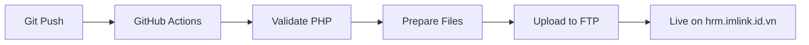

# 🚀 Deployment Guide - CI/CD with GitHub Actions

## 📋 Overview

This project uses **GitHub Actions** for automatic deployment to your production FTP server at `hrm.imlink.id.vn`.

Every time you push code to the `main` or `fixByAlex` branch, the application will automatically deploy to your server.

---

## ⚙️ Setup Instructions

### Step 1: Configure GitHub Secrets

You need to add FTP credentials as **GitHub Secrets** for security.

1. **Go to your GitHub repository**: https://github.com/imlinkk/QLNS

2. **Click on Settings** → **Secrets and variables** → **Actions**

3. **Click "New repository secret"** and add these 3 secrets:

   | Secret Name    | Value               | Description              |
   | -------------- | ------------------- | ------------------------ |
   | `FTP_SERVER`   | `imlink.id.vn`      | Your FTP server hostname |
   | `FTP_USERNAME` | `link@imlink.id.vn` | Your FTP username        |
   | `FTP_PASSWORD` | `123456`            | Your FTP password        |

   **⚠️ Important**:

   - Secret names must match exactly (case-sensitive)
   - Don't add quotes around values
   - Keep these credentials secure!

### Step 2: Verify Deployment Workflow

The workflow file is located at: `.github/workflows/deploy-ftp.yml`

It will automatically:

- ✅ Check PHP syntax
- 📦 Prepare deployment files
- 🧹 Remove development files (tests, docs, etc.)
- 🔒 Configure production .htaccess (HTTPS redirect, security)
- 🚀 Upload to FTP server
- 📊 Show deployment summary

### Step 3: Configure Production Database

**Before deploying**, update your production database credentials:

Edit `backend/config/Database.php`:

```php
<?php
namespace App\Config;

use PDO;
use PDOException;

class Database {
    // 🔧 UPDATE THESE FOR PRODUCTION:
    private const DB_HOST = 'localhost';  // Usually 'localhost' on shared hosting
    private const DB_NAME = 'cdmidkxg_imlink_hrm';  // Your database name from cPanel
    private const DB_USER = 'cdmidkxg_imlink_user'; // Your database user from cPanel
    private const DB_PASS = '2612Link@';            // Your database password
    private const DB_CHARSET = 'utf8mb4';

    // ... rest of the code
}
```

**💡 Tip**: You can also use environment variables for better security.

---

## 🎯 How to Deploy

### Automatic Deployment (Recommended)

Simply push your code to GitHub:

```bash
# Commit your changes
git add .
git commit -m "Your commit message"

# Push to trigger deployment
git push origin fixByAlex
# or
git push origin main
```

The deployment will start automatically. You can watch the progress in:

- **GitHub Actions tab**: https://github.com/imlinkk/QLNS/actions

### Manual Deployment

You can also trigger deployment manually:

1. Go to **Actions** tab in your GitHub repo
2. Click on **"🚀 Deploy to Production FTP"** workflow
3. Click **"Run workflow"** button
4. Select branch and click **"Run workflow"**

---

## 📊 Deployment Process



### What Gets Deployed:

✅ **Included**:

- `backend/` - All PHP backend files
- `frontend/` - All JavaScript files
- `assets/` - CSS and static files
- `index.html` - Main entry point
- `.htaccess` - Production-ready configuration

❌ **Excluded** (automatically removed):

- `/tests/` - Test files
- `/docs/` - Documentation
- `README.md` - GitHub documentation
- `FTP.md` - Credentials file
- `index.php` - Development test file
- `.git/` - Git repository files
- `*.md` - All markdown files

---

## 🔒 Production .htaccess Configuration

The deployment automatically creates a production `.htaccess` with:

```apache
# HTTPS Redirect
RewriteEngine On
RewriteCond %{HTTPS} off
RewriteRule ^(.*)$ https://%{HTTP_HOST}%{REQUEST_URI} [L,R=301]

# Frontend SPA Routing
RewriteCond %{REQUEST_FILENAME} !-f
RewriteCond %{REQUEST_FILENAME} !-d
RewriteCond %{REQUEST_URI} !^/backend/
RewriteRule ^(.*)$ index.html [L,QSA]

# Backend API Routing
RewriteCond %{REQUEST_FILENAME} !-f
RewriteCond %{REQUEST_FILENAME} !-d
RewriteRule ^backend/api\.php/(.*)$ backend/api.php [L,QSA]

# Security
Options -Indexes
<FilesMatch "\.(sql|md|json|lock|log|ini)$">
    Order allow,deny
    Deny from all
</FilesMatch>
```

---

## ✅ Post-Deployment Checklist

After deployment completes, verify:

1. **Visit Application**: https://hrm.imlink.id.vn
2. **Test Login**:
   - Username: `admin`
   - Password: `admin123`
3. **Check All Modules**:
   - Dashboard
   - Employee Management
   - Department Management
   - Position Management
   - Salary Management
   - Attendance Tracking
   - Leave Management
   - Performance Reviews
4. **Verify Database Connection**:
   - Open browser DevTools (F12)
   - Check Console for errors
   - Test CRUD operations
5. **Test API Endpoints**:
   - Visit: https://hrm.imlink.id.vn/backend/api.php/auth/check
   - Should return JSON response

---

## 🐛 Troubleshooting

### Deployment Failed

**Check GitHub Actions logs**:

1. Go to **Actions** tab
2. Click on the failed workflow run
3. Expand the failed step to see error details

**Common Issues**:

| Issue                     | Solution                                                |
| ------------------------- | ------------------------------------------------------- |
| **FTP Connection Failed** | Verify FTP credentials in GitHub Secrets                |
| **Permission Denied**     | Check FTP user has write permissions to `/public_html/` |
| **Files Not Uploading**   | Check server disk space and file permissions            |
| **Timeout Error**         | Server might be slow, try running workflow again        |

### Application Not Working After Deployment

1. **Database Connection Error**:

   ```
   Solution: Check Database.php credentials match your production database
   ```

2. **404 Errors on API**:

   ```
   Solution: Ensure .htaccess is uploaded and mod_rewrite is enabled
   ```

3. **Blank Page**:

   ```
   Solution: Check browser console (F12) for JavaScript errors
   Check PHP error logs in cPanel
   ```

4. **HTTPS Issues**:
   ```
   Solution: Ensure SSL certificate is installed on your domain
   Contact hosting support if needed
   ```

---

## 📝 Manual FTP Deployment (Alternative)

If you prefer manual deployment via FTP client:

### Using FileZilla:

1. **Download FileZilla**: https://filezilla-project.org/
2. **Connect**:
   - Host: `imlink.id.vn`
   - Username: `link@imlink.id.vn`
   - Password: `123456`
   - Port: `21`
3. **Navigate** to `/public_html/`
4. **Upload** these folders/files:
   - `backend/`
   - `frontend/`
   - `assets/`
   - `index.html`
   - `.htaccess`
5. **Set Permissions** (if needed):
   - Folders: `755`
   - Files: `644`

---

## 🔐 Security Best Practices

### For Production:

1. **Change Default Passwords**:

   ```sql
   -- Connect to production database and run:
   UPDATE users
   SET password_hash = PASSWORD('your-strong-password-here')
   WHERE username = 'admin';
   ```

2. **Use HTTPS Only**:

   - Already configured in .htaccess
   - Ensure SSL certificate is active

3. **Protect Sensitive Files**:

   - Already configured in .htaccess
   - `.sql`, `.md`, `.json` files are blocked

4. **Enable Error Logging** (disable display):

   ```php
   // In backend/api.php for production:
   error_reporting(E_ALL);
   ini_set('display_errors', 0);  // Don't show errors to users
   ini_set('log_errors', 1);       // Log errors to file
   ```

5. **Regular Backups**:
   - Use cPanel backup feature
   - Export database regularly
   - Keep local copy of production code

---

## 📈 Monitoring Deployment

### Check Deployment Status:

1. **GitHub Actions**: https://github.com/imlinkk/QLNS/actions
2. **Email Notifications**:
   - GitHub sends email on workflow success/failure
   - Enable in Settings → Notifications

### Deployment Logs:

Each deployment shows:

- ✅ PHP syntax validation results
- 📦 Files being deployed
- 📊 Deployment size and timing
- 🎉 Success/failure status

---

## 🎓 CI/CD Workflow Explained

```yaml
on:
  push:
    branches: [main, fixByAlex] # Trigger on push to these branches
  workflow_dispatch: # Allow manual trigger

jobs:
  deploy:
    runs-on: ubuntu-latest # Use Ubuntu server

    steps:
      - Checkout code # Get latest code
      - Validate PHP syntax # Check for errors
      - Prepare files # Remove dev files
      - Deploy to FTP # Upload to server
      - Show summary # Display results
```

---

## 🚀 Quick Reference

| Command                       | Action                 |
| ----------------------------- | ---------------------- |
| `git push origin fixByAlex`   | Deploy to production   |
| `git push origin main`        | Deploy to production   |
| Manual trigger in Actions tab | Deploy without pushing |

| URL                                                 | Purpose          |
| --------------------------------------------------- | ---------------- |
| https://hrm.imlink.id.vn                            | Live application |
| https://github.com/imlinkk/QLNS/actions             | View deployments |
| https://hrm.imlink.id.vn/backend/api.php/auth/check | Test API         |

---

## 💡 Tips

1. **Test Locally First**: Always test changes on localhost before pushing
2. **Small Commits**: Deploy small changes frequently rather than big releases
3. **Monitor Logs**: Check GitHub Actions logs after each deployment
4. **Backup First**: Keep backups before major deployments
5. **Database Migrations**: Update production database schema carefully

---

## 📞 Support

If you encounter issues:

1. **Check Logs**: GitHub Actions → Failed workflow → Expand step
2. **Check Server**: cPanel → Error Logs
3. **Check Browser**: F12 → Console tab
4. **Check Database**: phpMyAdmin → Check tables exist

---

**Happy Deploying! 🎉**

Your application will now automatically deploy every time you push code to GitHub!
