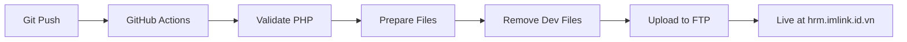

# ✅ CI/CD Setup Complete!

## 🎉 What's Been Done

Your HRM application now has **fully automated CI/CD deployment** to production!

---

## 📋 Files Created/Updated

### 1. **Deployment Workflow** ✅

- `.github/workflows/deploy-ftp.yml`
- Automatically deploys on push to `main` or `fixByAlex` branches
- Validates PHP syntax before deployment
- Removes test/dev files automatically
- Configures production .htaccess with HTTPS and security

### 2. **Configuration Files** ✅

- `.gitignore` - Prevents sensitive files from being committed
- `DEPLOYMENT.md` - Complete deployment documentation
- `GITHUB_SECRETS.md` - Quick setup guide for GitHub secrets
- `test-deployment.sh` - Pre-deployment validation script

### 3. **README Updated** ✅

- Added CI/CD section
- Added live demo link
- Updated feature checklist

---

## 🚀 How to Deploy (3 Steps)

### Step 1: Setup GitHub Secrets (One-time, 2 minutes)

Go to: https://github.com/imlinkk/QLNS/settings/secrets/actions

Add these 3 secrets:

| Secret Name    | Value               |
| -------------- | ------------------- |
| `FTP_SERVER`   | `imlink.id.vn`      |
| `FTP_USERNAME` | `link@imlink.id.vn` |
| `FTP_PASSWORD` | `123456`            |

**Detailed guide**: `GITHUB_SECRETS.md`

---

### Step 2: Commit & Push

```bash
# Stage all files
git add .

# Commit with message
git commit -m "🚀 Setup CI/CD deployment"

# Push to trigger deployment
git push origin fixByAlex
```

---

### Step 3: Watch Deployment

1. **Go to Actions tab**: https://github.com/imlinkk/QLNS/actions
2. **Watch the workflow run**: "🚀 Deploy to Production FTP"
3. **Wait for green checkmark**: ✅ (usually 1-2 minutes)
4. **Visit live site**: https://hrm.imlink.id.vn

---

## 🎯 What Happens When You Push?



### Deployment Process:

1. ✅ **Checkout Code** - Gets latest code from GitHub
2. ✅ **Validate PHP** - Checks all `.php` files for syntax errors
3. ✅ **Prepare Files** - Copies necessary files to deploy folder
4. ✅ **Configure Production** - Creates production `.htaccess` with:
   - HTTPS redirect
   - Security rules (block `.sql`, `.md` files)
   - Frontend SPA routing
   - Backend API routing
5. ✅ **Remove Dev Files** - Deletes:
   - `/tests/` folder
   - `/docs/` folder
   - `README.md`
   - `FTP.md`
   - `index.php`
   - All `.md` files
6. ✅ **Upload to FTP** - Deploys to `hrm.imlink.id.vn`
7. ✅ **Show Summary** - Displays deployment results

---

## 📁 What Gets Deployed

### ✅ Included in Deployment:

```
✅ backend/          (All PHP files)
✅ frontend/         (All JavaScript files)
✅ assets/           (CSS, images)
✅ index.html        (Main entry point)
✅ .htaccess         (Production config with HTTPS)
```

### ❌ Excluded from Deployment:

```
❌ tests/            (Test files)
❌ docs/             (Documentation)
❌ .git/             (Git repository)
❌ .github/          (GitHub workflows)
❌ README.md         (GitHub docs)
❌ FTP.md            (Credentials)
❌ *.md              (All markdown files)
❌ index.php         (Development test file)
```

---

## 🔒 Production Security

The deployment automatically configures security:

### HTTPS Redirect

```apache
# Force HTTPS
RewriteCond %{HTTPS} off
RewriteRule ^(.*)$ https://%{HTTP_HOST}%{REQUEST_URI} [L,R=301]
```

### File Protection

```apache
# Block sensitive files
<FilesMatch "\.(sql|md|json|lock|log|ini)$">
    Order allow,deny
    Deny from all
</FilesMatch>
```

### Prevent Directory Browsing

```apache
Options -Indexes
```

---

## ✅ Post-Deployment Checklist

After first deployment:

1. [ ] **Visit site**: https://hrm.imlink.id.vn
2. [ ] **Test login**: admin / admin123
3. [ ] **Check all modules**:
   - [ ] Dashboard
   - [ ] Employee Management
   - [ ] Department Management
   - [ ] Position Management
   - [ ] Salary Management
   - [ ] Attendance Tracking
   - [ ] Leave Management
   - [ ] Performance Reviews
4. [ ] **Test CRUD operations**
5. [ ] **Verify database connection**
6. [ ] **Check browser console** for errors
7. [ ] **Test API**: https://hrm.imlink.id.vn/backend/api.php/auth/check

---

## 🎓 Usage Examples

### Deploy After Making Changes:

```bash
# Edit some files
nano frontend/controllers/EmployeeController.js

# Commit and deploy
git add .
git commit -m "Fix employee listing bug"
git push origin fixByAlex

# Deployment starts automatically!
```

### Manual Deployment (Without Pushing):

1. Go to: https://github.com/imlinkk/QLNS/actions
2. Click: "🚀 Deploy to Production FTP"
3. Click: "Run workflow" button
4. Select branch: `fixByAlex`
5. Click: "Run workflow"

---

## 📊 Monitor Deployments

### GitHub Actions Dashboard:

https://github.com/imlinkk/QLNS/actions

You'll see:

- ✅ Green = Success
- ❌ Red = Failed
- 🔄 Yellow = Running

### Deployment Logs Show:

```
================================================
🚀 DEPLOYMENT INFORMATION
================================================
📅 Date: 2025-11-08 10:30:00
🌿 Branch: fixByAlex
💾 Commit: a1b2c3d4
👤 Author: imlinkk
📝 Message: Setup CI/CD deployment
🌐 Target: hrm.imlink.id.vn
📂 Files to deploy:
    24M backend
    8M  frontend
    4M  assets
================================================
```

---

## 🐛 Troubleshooting

### Deployment Failed?

1. **Check GitHub Actions logs**:

   - Go to Actions tab
   - Click failed workflow
   - Expand failed step
   - Read error message

2. **Common Issues**:

   | Issue                 | Solution                          |
   | --------------------- | --------------------------------- |
   | FTP Connection Failed | Verify GitHub Secrets are correct |
   | Permission Denied     | Check FTP user has write access   |
   | PHP Syntax Error      | Run `php -l filename.php` locally |
   | Timeout               | Server slow, retry deployment     |

3. **Need Help?**
   - Check `DEPLOYMENT.md` for full troubleshooting guide
   - Check server error logs in cPanel

---

## 🎯 Development Workflow

### Recommended Workflow:

```bash
# 1. Make changes locally
# Edit files in VS Code

# 2. Test locally first
php -S localhost:8000
# Visit: http://localhost:8000

# 3. Run pre-deployment tests (optional)
bash test-deployment.sh

# 4. Commit changes
git add .
git commit -m "Descriptive message"

# 5. Push to deploy
git push origin fixByAlex

# 6. Wait for deployment (1-2 minutes)
# Watch: https://github.com/imlinkk/QLNS/actions

# 7. Verify on production
# Visit: https://hrm.imlink.id.vn
```

---

## 📚 Documentation Files

- **DEPLOYMENT.md** - Complete deployment guide
- **GITHUB_SECRETS.md** - GitHub secrets setup
- **test-deployment.sh** - Pre-deployment validation
- **README.md** - Project overview (updated with CI/CD section)

---

## 🎊 Next Steps

1. **Setup GitHub Secrets** (if not done yet)

   - Follow `GITHUB_SECRETS.md`

2. **Test Deployment**

   ```bash
   git add .
   git commit -m "Test CI/CD deployment"
   git push origin fixByAlex
   ```

3. **Verify Production**

   - Visit: https://hrm.imlink.id.vn
   - Login and test all features

4. **Update Database**

   - Ensure production database has correct credentials
   - Run `install_db.php` on production if needed

5. **Change Default Password**
   - Login to production
   - Change admin password from `admin123`

---

## 🏆 You're All Set!

Your HRM application now has:

✅ Professional CI/CD pipeline  
✅ Automatic deployments on push  
✅ Production security configuration  
✅ Deployment monitoring  
✅ Error validation before deployment

**Every time you push code, it will automatically deploy to production!**

---

## 🆘 Support

If you encounter any issues:

1. Check `DEPLOYMENT.md` for detailed troubleshooting
2. Review GitHub Actions logs
3. Check server error logs in cPanel
4. Verify FTP credentials
5. Test locally before deploying

---

**Happy Deploying! 🚀**

Your application is ready for continuous deployment to production!
